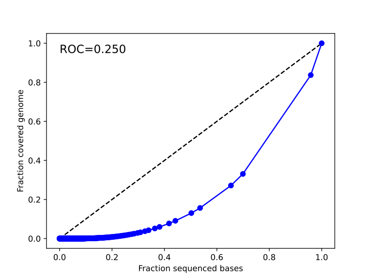
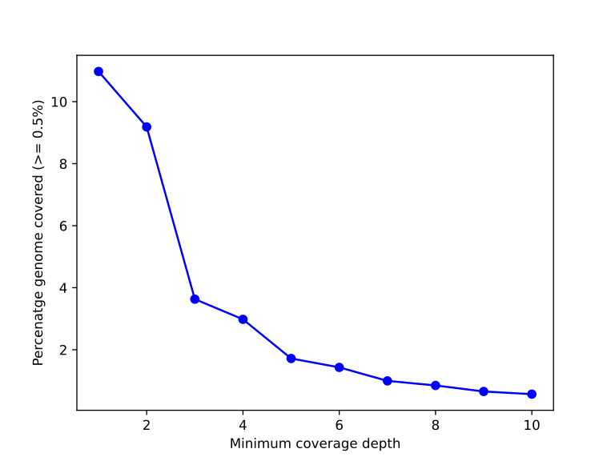
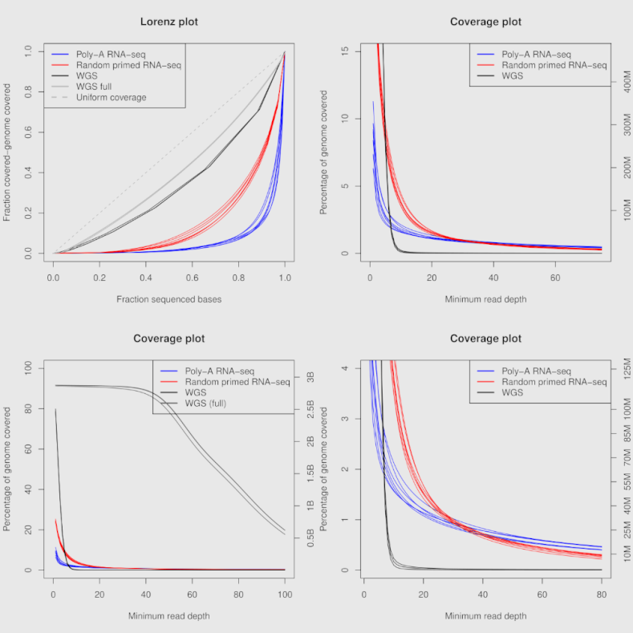

bam-lorenz-coverage
===================

This is a free software package that very easily allows you to generate
Lorenz plots and Coverage plots, directly from a BAM file. It can also
output the tables as text documents so you can generate custom plots.
There is also support to only analyse specific regions.

Implemented in:
 * Python3 + Matplotlib + Pysam


### Note (how this works) ####

By the time of writing, pysam.tools.depth could not write sequentially
to a python variable. As work around, the tools spawns one thread
writing the output of pysam.tools.depth to a FIFO (named pipe) in the 
/tmp folder whereas the other thread parses this FIFO. This is why the
tool runs two parallel threads.


## Installation: ##

```
$ git clone https://github.com/yhoogstrate/bam-lorenz-coverage.git
$ cd bam-lorenz-coverage
$ virtualenv -p python3 .venv
$ source .venv/bin/activate
$ python setup.py install

$ bam-lorenz-coverage --help
```

Possible issues:
 - pysam is currently incompatible with python 3.7 - manual installation of pysam is still possible (git clone + python setup.py install)
   * This issue has been resolved
 - matplotlib depends on Tk but does not throw an error if it is missing during installation, only at runtime
   * debian/ubuntu: sudo apt-get install python3-tk
   * arch: pacman -Sy tk

## Usage: ##

```
Usage: bam-lorenz-coverage [OPTIONS] INPUT_ALIGNMENT_FILE

Options:
  --version                  Show the version and exit.
  -l, --lorenz-table TEXT    Output table Lorenz-curve (for stdout use: -)
  -c, --coverage-table TEXT  Output table Coverage-graph (for stdout use: -)
  -L, --lorenz-svg TEXT      Output figure Lorenz-curve (SVG).
  -C, --coverage-svg TEXT    Output figure Coverage-graph (SVG).
  -s, --stats TEXT           Output additional stats to text-file
  -r, --region TEXT          Scan depth only in selected region <chr:from-to>
                             (all positions: 1-based)
  -b, --bed-regions TEXT     Scan depth only in selected positions or regions
                             (BED file: start: 0-based & end: 1-based)
  --help                     Show this message and exit.
```

The lowercase arguments (-l, -c) allow extraction of the raw data tables for custom plotting. The uppercase arguments (-L, -C) directly generate a plot. The implemented plot only contains one sample per plot. For multi-sample plots, use the column tables and your imagination.

## Examples: ##
### Default: ###

The default SVG output figures (`-C`, `-L`) show one sample per figure, and look as follows:






### Custom, using the tables: ###

Using the output tables (`-l`, `-c`) you can also create custom plots, for instance:




