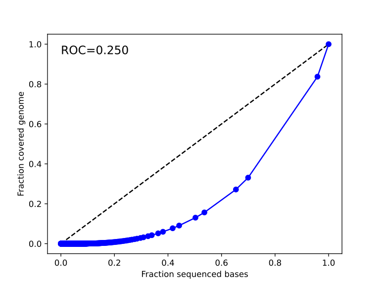
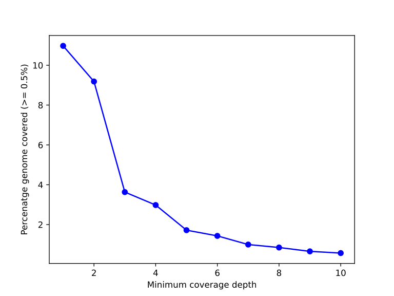
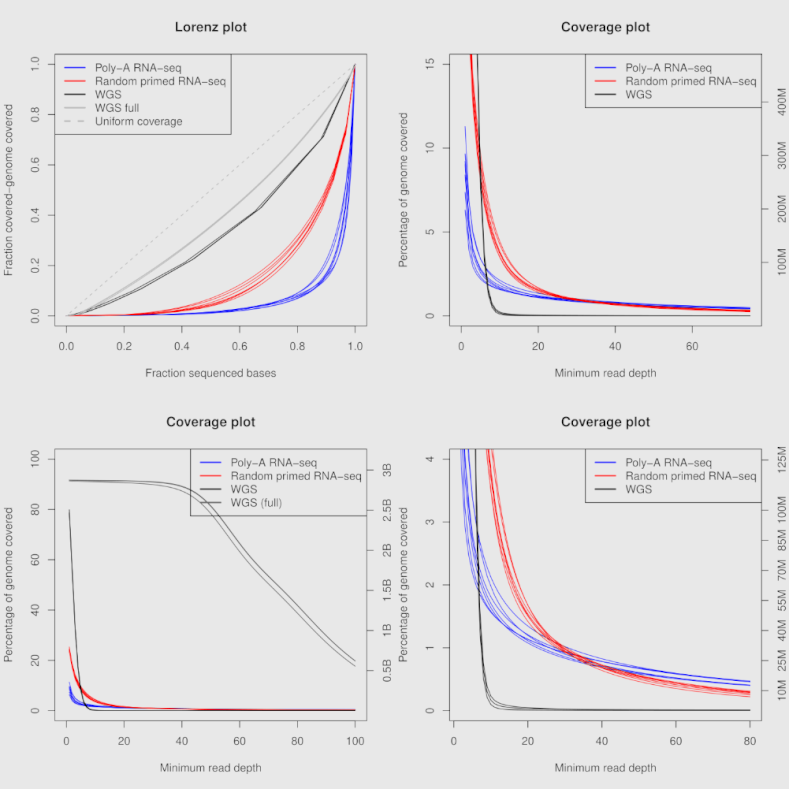

bam-lorenz-coverage
===================

A tool to generate Lorenz plots and coverage plots directly from a BAM file,
using Python3, Matplotlib, Pysam and Click. Raw data tables can be exported
for custom plotting, and analysis can be restricted to specific regions via
a region string or BED file.

## How it works ##

The tool spawns two parallel processes: one writes `samtools depth -a` output
to a FIFO (named pipe) in `/tmp`, while the other reads and parses it. This
avoids writing large temporary files to disk.

## Installation ##

```
$ git clone https://github.com/yhoogstrate/bam-lorenz-coverage.git
$ cd bam-lorenz-coverage
$ ./scripts/install.sh

$ bam-lorenz-coverage --help
```

Possible issues:
 - `python3-venv` may need to be installed separately on Debian/Ubuntu:
   `sudo apt install python3-venv`
 - matplotlib depends on Tk but does not throw an error if it is missing during installation, only at runtime
   * debian/ubuntu: `sudo apt-get install python3-tk`
   * arch: `pacman -Sy tk`

## Usage: ##

```
Usage: bam-lorenz-coverage [OPTIONS] INPUT_ALIGNMENT_FILE

Options:
  --version                  Show the version and exit.
  -l, --lorenz-table TEXT    Output table Lorenz-curve (for stdout use: -)
  -c, --coverage-table TEXT  Output table Coverage-graph (for stdout use: -)
  -L, --lorenz-svg TEXT      Output figure Lorenz-curve (SVG).
  -C, --coverage-svg TEXT    Output figure Coverage-graph (SVG).
  -s, --stats TEXT           Output additional stats to text-file
  -r, --region TEXT          Scan depth only in selected region <chr:from-to>
                             (all positions: 1-based)
  -b, --bed-regions TEXT     Scan depth only in selected positions or regions
                             (BED file: start: 0-based & end: 1-based)
  --help                     Show this message and exit.
```

The lowercase arguments (-l, -c) allow extraction of the raw data tables for custom plotting. The uppercase arguments (-L, -C) directly generate a plot. The implemented plot only contains one sample per plot. For multi-sample plots, use the column tables and your imagination.

## Examples: ##
### Default: ###

The default SVG output figures (`-C`, `-L`) show one sample per figure, and look as follows:






### Custom, using the tables: ###

Using the output tables (`-l`, `-c`) you can also create custom plots, for instance:




